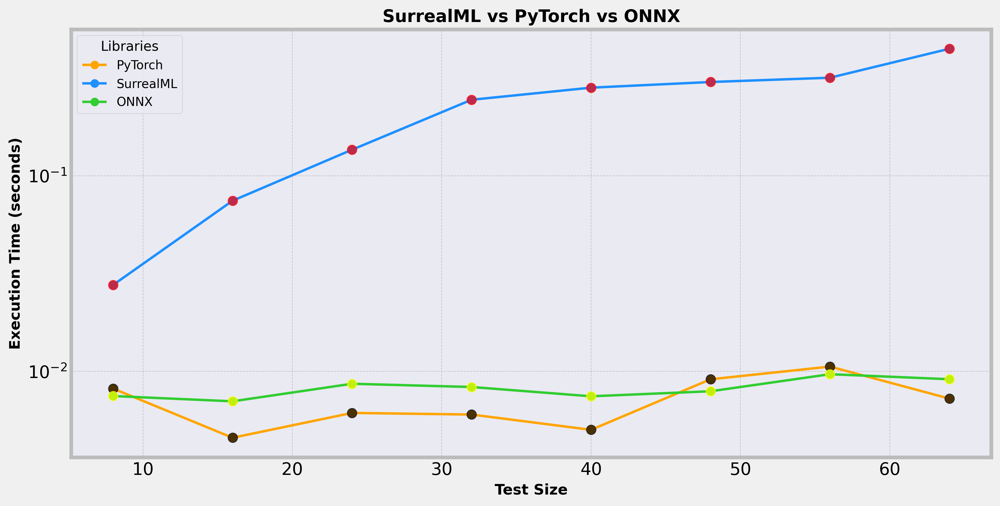

# SurrealML versus PyTorch versus ONNX

SurrealML simplifies storing, loading, and executing trained ML models, working alongside existing frameworks like PyTorch, TensorFlow, linfa, and ONNX, and supports execution in both Python and Rust.

In this repo, you can find the source code behind the following comparison, which shows execution times for `SurrealML`, as contrasted with `PyTorch` and `ONNX`.
